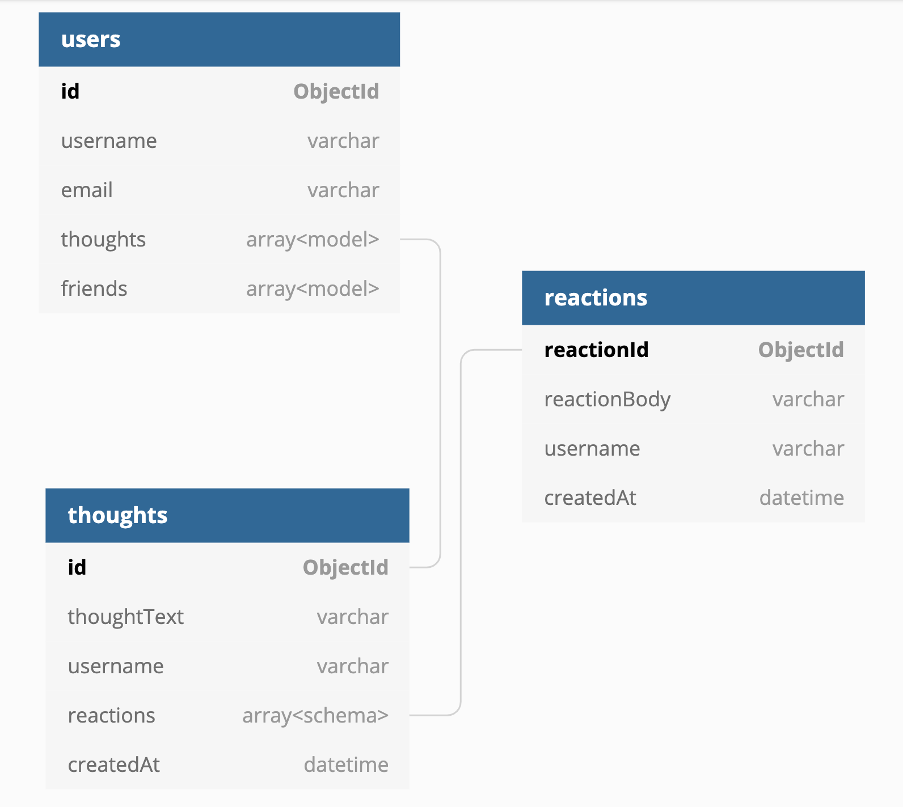

Social Media API
====

<a target="_blank" href="https://github.com/Siphon880gh" rel="nofollow"></a>
<a target="_blank" href="https://www.linkedin.com/in/weng-fung/" rel="nofollow"></a>
<a target="_blank" href="https://www.youtube.com/@WayneTeachesCode/" rel="nofollow"></a>
<a target="_blank" href="https://www.paypal.com/donate?business=T42BK25TYPZSA&item_name=Buy+me+coffee+%28I+develop+free+apps%29&currency_code=USD" title="Donate to this project using Buy Me A Coffee" alt="Paypal"></a>


Description
---
By Weng Fei Fung. Social media backend with users, thoughts, and reactions. This is a MongoDB-Mongoose-Node database and restful API routes. Can be incorporated into your React app in a MERN stack.

Video Walkthrough
---
Watch the [walkthrough](https://www.youtube.com/watch?v=NpPc12I0C4M)

Screenshot
---


Table of Contents
---
- [Description](#description)
- [Video Walkthrough](#video-walkthrough)
- [Screenshot](#screenshot)
- [Installation](#installation)
- [Schema](#schema)
- [API Routes](#api-routes)
- [Tests](#tests)
- [Questions](#questions)

Installation
---
1. Run `npm install`. 

2. Open mongod server by running the command `mongod`.

3. You may want to seed some data so you can test out the database by running `npm run seed`. 

4. Now you can run the API on localhost with `npm start`. Open an API test tool to "localhost:3001/api/<API_ENDPOINT>" and change the request method to the appropriate one. This can be Insomnia Core or Postman.

5. Look into the [Tests](#tests) section for further instructions. Once you are satisfied, you can adapt this code to your node project.

Schema
---


API Routes
---

### `/api/users`

- GET all users
- POST a new user
    - Test case:

        ```
        body: 
        {
            "username": "NEW_USER_FOR_DEMO",
            "email": "fake-email-20210223@fake-domain.com"
        }
        ```


### `/api/users/:userId`

- GET a single user by its \_id and populate its thought and friend data
- PUT to update a user by its \_id
    - Test case:

        ```
        body: 
        {
            "email": "testUser@updated-domain.com"
        }
        ```

- [x] DELETE to remove user by its \_id

### `/api/users/:userId/friends/:friendId`

- POST to add a new friend to a user's friend list
- DELETE to remove a friend from a user's friend list

### `/api/thoughts`

- GET to get all thoughts
- POST to create a new thought (and push the created thought's \_id to the associated user's thoughts array field)
    - Test case:

        ```
        body: 
        {
            "username": "testUser",
            "thoughtText": "I am a thought"
        }
        ```

### `/api/thoughts/:thoughtId`
- GET to get a single thought by its \_id
- PUT to update a thought by its \_id
    - Test case:

        ```
        body: 
        {
            "thoughtText": "I am thinking of another..."
        }
- DELETE to remove a thought by its \_id

### `/api/thoughts/:thoughtId/reactions`

- POST to create a reaction stored in a single thought's reactions array field
    - Test case:

        ```
        body: 
        {
            "reactionBody": "I am reacting to your thought",
        }

### `/api/thoughts/:thoughtId/reactions/:reactionId`
- DELETE to pull and remove a reaction by the reaction's reactionId value


Tests
---
The database tests can be ran with `npm run test`

You can test each routes at [API route checklist](./Tests.md).


Questions
---
- Where can I see more of your repositories?
	- Visit [Siphon880gh's Repositories](https://github.com/Siphon880gh)

- Where can I reach you?
	- You can reach me with additional questions at <a href='mailto:weffung@ucdavis.edu'>weffung@ucdavis.edu</a>.
	- Want to [hire me](https://www.linkedin.com/in/weng-fung/)?
